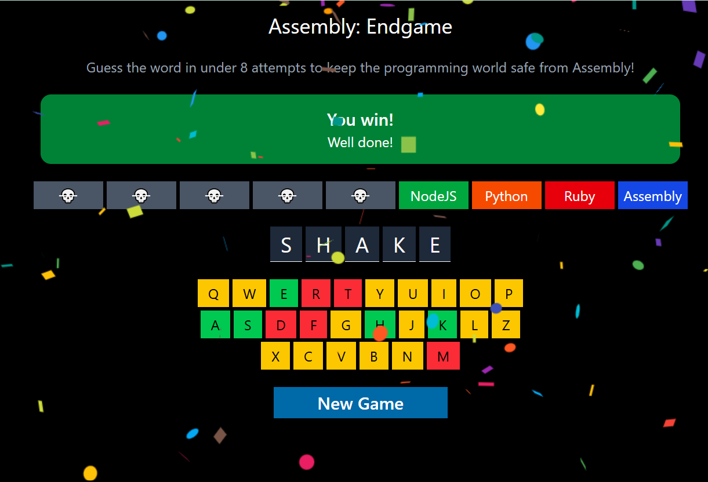

# Assembly: Endgame

## Overview

**Assembly: Endgame** is an interactive browser-based word guessing game built with **React** and styled using **Tailwind CSS**.



The goal is to guess a hidden programming-related word before all the "chips" (representing programming languages) are eliminated. Each incorrect guess removes a chip, bringing the player closer to defeat.

The game combines:

* Classic word-guessing mechanics.
* A thematic twist where the player is trying to protect the programming world from being overtaken by Assembly.
* Dynamic, responsive UI with real-time updates.

---

## Features

* **Random word generation** from a predefined list.
* **Visual "chips"** representing programming languages that are lost when a wrong guess is made.
* **Dynamic keyboard** that changes colors:

  * Yellow: Not yet guessed.
  * Green: Correct guess.
  * Red: Incorrect guess.
* **Win/Loss conditions** with corresponding messages and styles.
* **Confetti animation** for a win celebration.
* **Restart button** for starting a new game.

---

## How to Play

1. The game starts with a secret word displayed as blank spaces.
2. Click on letters from the on-screen keyboard to make guesses.
3. Correct guesses reveal letters in the word.
4. Incorrect guesses remove one programming language chip and display a farewell message.
5. Win by guessing the word before all chips are lost.
6. Lose if you run out of chips before completing the word.

---

## Technologies Used

* **React** for building the interactive UI.
* **Tailwind CSS** for styling.
* **clsx** for conditional class handling.
* **react-confetti** for the win animation.
* **JavaScript ES6** features such as `map`, `filter`, and state hooks.

---

## File Structure

```
assembly-endgame/
├── dist/                  # Production build output
├── node_modules/          # Project dependencies
├── public/                # Public assets
├── src/
│   ├── assets/            # Image and static assets
│   ├── App.jsx            # Main game component
│   ├── index.css          # Tailwind and custom styles
│   ├── main.jsx           # App entry point
│   ├── utils.js           # Utility functions (word generation, messages)
│   ├── words.js           # Word list for the game
├── .gitignore
├── eslint.config.js
├── index.html
├── package.json
├── README.md
└── vite.config.js
```

---

## Installation & Setup

1. **Clone the repository**

   ```bash
   git clone https://github.com/yourusername/assembly-endgame.git
   cd assembly-endgame
   ```
2. **Install dependencies**

   ```bash
   npm install
   ```
3. **Run the development server**

   ```bash
   npm run dev
   ```
4. **Build for production**

   ```bash
   npm run build
   ```

---

## Deployment

This project is compatible with **GitHub Pages** or any static hosting service.
To deploy:

* Build with `npm run build`.
* Upload the contents of the `dist` folder to your hosting provider.

---

## Live Demo

You can try the game here:
[**Play Assembly: Endgame**](YOUR_PROJECT_LINK)

---

## License

This project is open source and available under the [MIT License](LICENSE).

---
